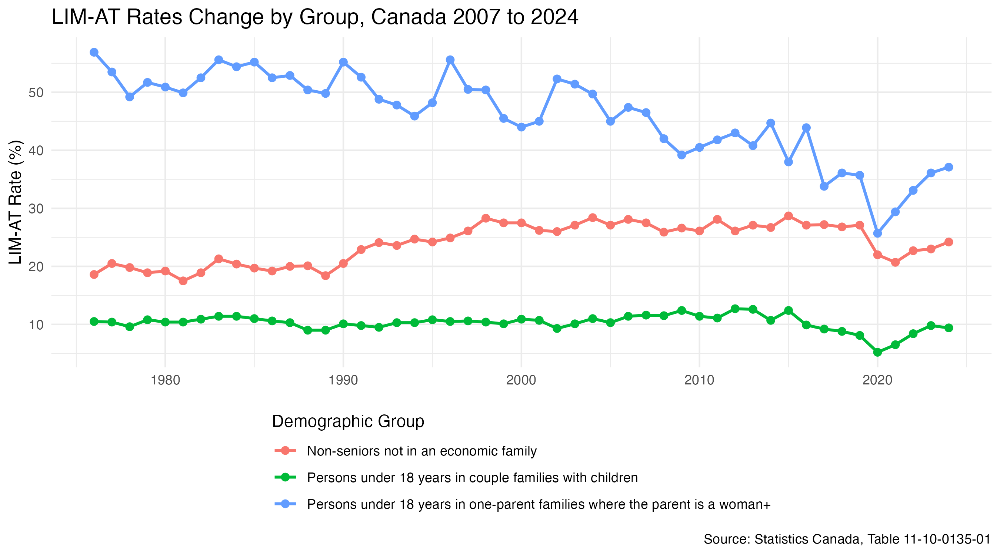
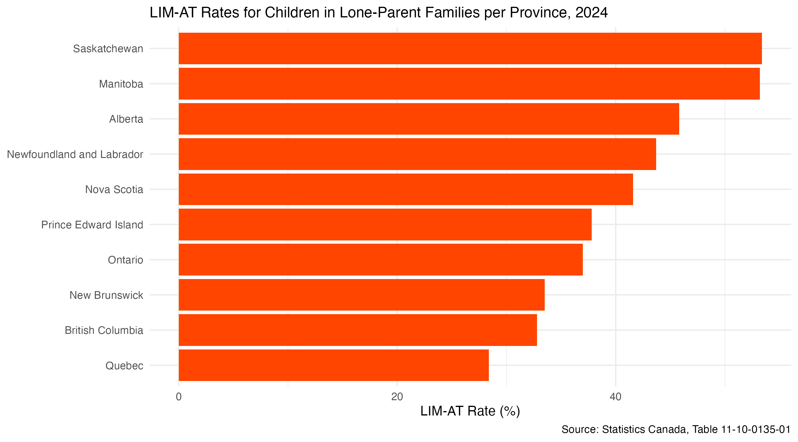

## Introduction

Child poverty represents a persistent policy challenge across developed economies, with cash transfer programs increasingly recognized as a primary instrument for addressing it [@Bornukova2024Investing]. In Canada, the Canada Child Benefit (CCB) is a single income-tested tax-free monthly cash transfer to eligible families to help with the cost of raising children under 18 years of age. The CCB replaced a patchwork of three programs: the Universal Child Care Benefit (UCCB), the Canada Child Tax Benefit (CCTB), and the National Child Benefit (NCB). The CCTB and NCB were income tested but modest, whilst the UCCB was universal but taxable, meaning its real value varied by income bracket [@baker2023effects]. The CCB addressed these limitations by providing larger, tax-free transfers concentrated among lower-income families, with benefit levels phasing out as household income rises. This marks a departure from the flat-rate, pre-tax structure of the UCCB [@baker2023effects]. The Canadian Department of Finance credited the program with lifting approximately 300,000 children out of poverty and projected child poverty rates 40% below their 2013 level [@baker2023effects].

## Research Question(s) & Hypotheses

It was established that the CCB concentrates larger transfers among lower-income families. This income-tested design offers a natural lens for examining and comparing between exposed and unexposed groups before and after the policy change and whether the program reduced child poverty, and whether its effects differed across family types. This analysis would explore three related questions.

RQ1: Did the introduction of the CCB reduce LIM-AT rates among children in lone-parent families? We expect LIM-AT rates among children in lone-parent families to have declined following July 2016, as CCB transfers flowed directly to this group.

RQ2: Did the introduction of the CCB reduce LIM-AT rates among children in two-parent families? We expect a similar post-2016 decline for children in two-parent families, though likely smaller in magnitude given their generally higher household incomes and correspondingly lower CCB transfer amounts.

RQ3: Was the post-CCB reduction in LIM-AT rates larger for children in lone-parent families than in two-parent families? We expect the decline to have been larger for children in lone-parent families, consistent with the CCB's income-tested structure concentrating larger transfers among lower-income households.

All three questions test whether the program's design translated into measurably different outcomes across family types, with direct implications for how income-tested child benefits should be structured.

##  Dataset & Methods

Poverty is measured using the Low Income Measure After Tax (LIM-AT), defined as 50% of median adjusted after-tax household income [@statisticscanada2024], and widely used in comparative poverty research. Annual LIM-AT rates are drawn from Statistics Canada Table 11-10-0135-01 [@statisticscanada2024], covering the period 1976 to 2024. The lone-parent group is restricted to families where the parent is a woman, as the dataset does not separately report lone-father families. LIM-AT is particularly suitable for this analysis because it measures poverty based on how far a household's income falls from the median in Canada while adjusting for household size, making it appropriate for comparing economic well-being across different family structures and ensuring that observed differences reflect meaningful disparities in living standards rather than differences in household composition.

Because the CCB is a universal, income-tested benefit, all eligible families with children received some transfer after its July 2016 introduction; there is no strictly untreated group among families with children. We therefore adopt a **differential-intensity difference-in-differences (DiD) design**: lone-parent families, who receive proportionally larger CCB transfers due to their lower average household income, serve as the higher-intensity "treated" group, while two-parent families serve as a lower-intensity comparison group. DiD does not require a fully untreated control group when treatment intensity varies systematically across groups, provided the parallel-trends assumption holds during the pre-treatment period [cite DiD chapter].

The pre-CCB period spans 2007 to 2015 and the post-CCB period spans 2016 to 2024. We estimate:

$$
\text{PovertyRate}_{it} = \beta_0 + \beta_1 \text{treated}_i + \beta_2 \text{post_2016}_t + \beta_3 (\text{treated}_i \times \text{post_2016}_t) + \varepsilon_{it}
$$

where $\text{Treated}_i = 1$ for lone-parent families and $0$ for two-parent families, $\text{Post2016}_t = 1$ for years 2016–2024 and $0$ otherwise, and $\beta_3$ is the DiD estimator capturing the additional post-2016 change in LIM-AT rates for lone-parent families relative to two-parent families, over and above any shared time trend. Because this analysis relies on aggregated family-type data rather than individual-level microdata, it is not possible to identify which specific individuals received the CCB or to control for household-level characteristics directly; the DiD structure instead identifies the policy's effect from the differential change in group-level trends around the 2016 reform.

## Assumptions & Limitations
The dataset is structured as a repeated cross-sectional time series, with observations defined at the intersection of year, demographic group, and geography. A key limitation of the dataset is that it reports aggregate low-income rates rather than individual-level microdata, which prevents direct identification of which households receive the CCB; as a result, the analysis cannot control for household-level characteristics (e.g., education, employment status) and instead relies on group-level trends, which may introduce out of scope factors that are not explicitly accounted for. A key assumption in this analysis is that, before the introduction of the CCB, LIM-AT rates for lone-parent and two-parent families would have continued to follow similar trends this comparison allows us to distinguish policy-related changes from broader economic trends that affect all groups. In other words, if the policy had not been introduced, we would expect both groups to continue following similar patterns. This can be checked by looking at pre-2016 trends in the data: if they appear fairly stable and roughly parallel, the comparison becomes more credible. However, this interpretation should be made cautiously, since it relies on the assumption that no other major policy changes or external factors affected the groups differently during the same period. To strengthen the analysis further, patterns can also be compared across provinces, since differences in regional economic conditions and baseline poverty levels may influence the size of the observed effects.

The dataset is structured as a repeated cross-sectional time series, with observations defined at the intersection of year, demographic group, and geography. A key limitation of the dataset is that it reports aggregate low-income rates rather than individual-level microdata, which prevents direct identification of which households receive the CCB; as a result, the analysis cannot control for household-level characteristics (e.g., education, employment status) and instead relies on group-level trends, which may introduce out of scope factors that are not explicitly accounted for. A key assumption underlying this design is that, before the introduction of the CCB, LIM-AT rates for lone-parent and two-parent families would have continued to follow similar trends. To assess the plausibility of this assumption, we additionally examine pre-2016 trends for non-senior adults without children as a separate benchmark series; this group receives no CCB transfer at all, so if its low-income trend also moved in step with the two family-type series prior to 2016, this supports the claim that our DiD estimates reflect the CCB specifically rather than a broader economy-wide shift affecting all Canadians. This benchmark check is descriptive and is not itself a treated/control group within the DiD model. However, this interpretation should be made cautiously, since it relies on the assumption that no other major policy changes or external factors affected the groups differently during the same period. To strengthen the analysis further, patterns can also be compared across provinces, since differences in regional economic conditions and baseline poverty levels may influence the size of the observed effects.

##  Exploratory Data Analysis

Figure 1 shows that lone-parent rates run roughly 30 percentage points above two-parent rates throughout the period, trending downward from around 44% in 2015 to 37% by 2024, though the post-2021 uptick suggests some of that improvement reversed as COVID supports wound down. The sharp 2020 drop across all three groups almost certainly reflects the CERB. Notably, the benchmark group remains flat outside of 2020, suggesting that changes in the children groups are not simply tracking broader economic trends.

Figure 2 shows that Saskatchewan and Manitoba are the only provinces with LIM-AT rates above 50%, partly reflecting their demographic composition: Indigenous people made up 17% and 18.1% of each province's population in 2021, among the highest shares nationally [@statisticscanada2021census]. Given that Indigenous Canadians face persistent income disadvantages [@pendakur2011aboriginal] and nearly one in four Indigenous children already lives in a low-income household, more than double the non-Indigenous rate, higher aggregate LIM-AT rates in these provinces are expected [@statisticscanada2021census].



## References

::: {#refs}
:::